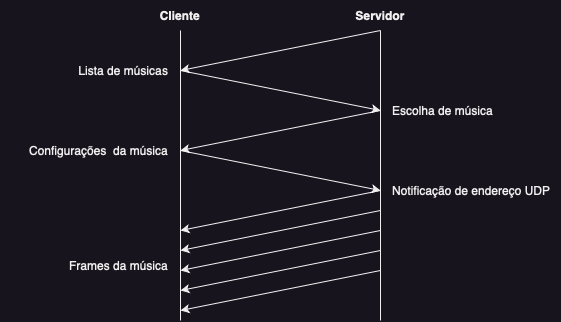

# Documentação - Streaming de Áudio

Este é um arquivo README.md que contém a documentação para um sistema de streaming de áudio utilizando os protocolos UDP e TCP.

## Sumário

1. [UDP / TCP](#1-udp--tcp)
2. [Configurações dos protocolos](#2-configurações-dos-protocolos)
3. [Mensagens](#3-mensagens)
4. [Fluxo](#4-fluxo)
5. [Módulos](#5-módulos)
6. [Instalação e execução](#6-instalação-e-execução)

## 1. UDP / TCP

No protocolo TCP, existe uma conexão entre o cliente e o servidor, como uma espécie de aperto de mãos entre os dois, que dura até que um deles desconecte. No módulo socket, em Python, por exemplo, isso faz com que o programa levante erros no caso de ocorrer algum problema na transmissão de alguma mensagem.

Já em UDP, não existe essa conexão. Um host apenas envia um datagrama para outro host na rede e não se importa se este host o recebeu ou não. Isso dificulta as coisas quando, por exemplo, queremos saber se o cliente ainda está conectado, para que possamos evitar que o servidor gaste recursos enviando dados para um cliente que não existe.

## 2. Configurações dos protocolos

Os dois protocolos (TCP e UDP) foram utilizados no trabalho:

- `Servidor TCP` - Rodando na porta 9090
- `Servidor UDP` - Rodando na porta 9191
- `Cliente TCP` - Rodando em uma porta aleatória (definida pelo sistema)
- `Cliente UDP` - Rodando em uma porta aleatória (definida pelo sistema)

## 3. Mensagens

### Notificação de endereço (UDP)

Direção: Cliente → Servidor

O cliente, antes de qualquer outra comunicação com o servidor via UDP, deve enviar primeiro uma mensagem para o servidor para que ele possa saber o seu endereço na rede.

### Mensagem de retorno (UDP)

Direção: Cliente → Servidor

Como explicado anteriormente, não existe uma conexão entre servidor e cliente em UDP. Portanto, para cada mensagem que o servidor envia para o cliente via UDP, o cliente deverá enviar uma resposta apenas para confirmar que recebeu a mensagem.

### Escolha de música (TCP)

Direção: Servidor ⇄ Cliente

O servidor envia a lista de músicas disponíveis e o cliente responde com a sua escolha.

### Envio de configurações de música (TCP)

Direção: Servidor → Cliente

O servidor lê os dados da música escolhida e cria uma mensagem contendo os dados necessários para que ela possa ser tocada no lado do cliente (ex: framerate, tamanho, etc).

### Envio de música (UDP)

Direção: Servidor → Cliente

O servidor lê os frames da música e os envia para o endereço do cliente em pedaços. O cliente então usa esses frames para tocar a música.

## 4. Fluxo

O fluxo do sistema consiste nas etapas descritas acima, onde o cliente e o servidor se comunicam utilizando os protocolos TCP e UDP para transmitir as informações e os frames de áudio.

## 5. Módulos

A seguir estão os módulos utilizados no sistema:

- `Socket:` O módulo Socket foi utilizado para realizar a interação entre o servidor e o cliente.
- `Threading:` Utilizado para implementar o acesso de vários clientes ao servidor.
- `Queue:` O pacote Queue (fila) foi usado para guardar os frames recebidos em excesso pelo cliente. Dessa forma, o cliente poderia receber mais frames do que precisava em algum momento, eliminando o efeito de "picote" no áudio.
- `Wave:` Utilizado para fazer a leitura dos frames e configurações dos arquivos de áudio das músicas.
- `PyAudio:` O módulo PyAudio foi utilizado para tocar os frames de áudio no lado do cliente.
- `Time:` Utilizado para obrigar a execução do código a esperar em certos momentos, como no envio de frames do servidor para o cliente para evitar o seu sobrecarregamento.
- `JSON:` Utilizado para utilizar dados complexos (como listas e dicionários) no envio de mensagens.
- `OS:` Módulo utilizado para fazer a leitura dos nomes dos arquivos de música no diretório das músicas.

## 6. Instalação e execução

Para que a instalação e execução do código ocorra de maneira correta, basta baixar todos os seguintes módulos do python atravez do PIP.

### Pré-requisitos

1. Verifique a versão do seu python, utilizar versão 3 ou superior
2. Certifique-se de ter as seguintes bibliotecas instaladas antes de executar o código:
  - Wave
    
    <pre>$ pip install wave</pre>
  
  - PyAudio:
    
    <pre>$ pip install pyaudio</pre>
    
3. Certifique-se que o cliente esteja na mesma rede do servidor.
4. Execute o arquivo do servidor.
5. Execute o arquivo do cliente.
